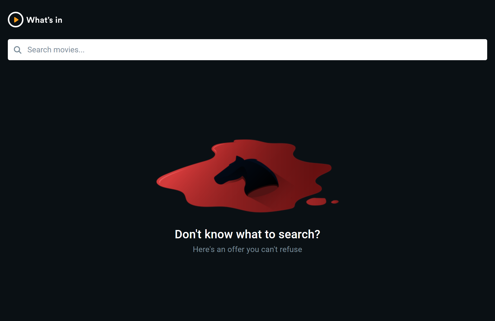
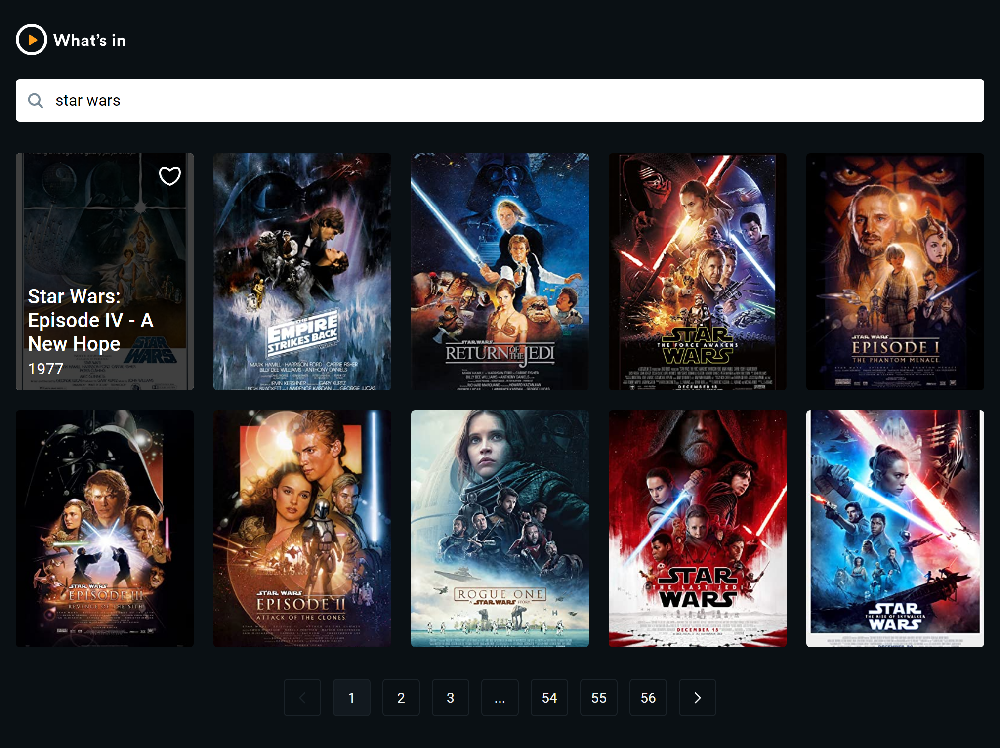
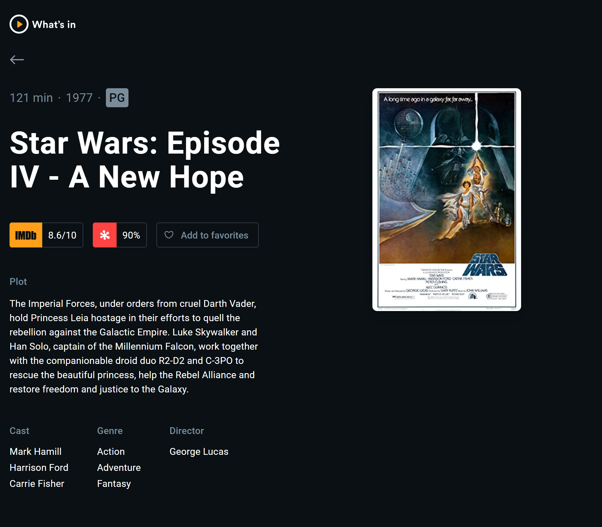

# Significa - Front-end challenge solution

This is a solution to the [Significa's front-end challenge](https://github.com/Significa/frontend-challenge). 

## Summary

- [Overview](#overview)
  - [The challenge](#the-challenge)
  - [Screenshots](#screenshots)
  - [Links](#links)
- [Process](#process)
  - [Built with](#built-with)

## Overview

### The challenge

Users should be able to:

- Search for a movie and see the search result
- Go to a movie details page
- Bookmark a movie (this information is persistent)

### Screenshots

### Links

- Live Site URL: 

## Process

### Built with

- ReactJS
- Axios
- Vite
- TypeScript
- CSS
- BEM methodology